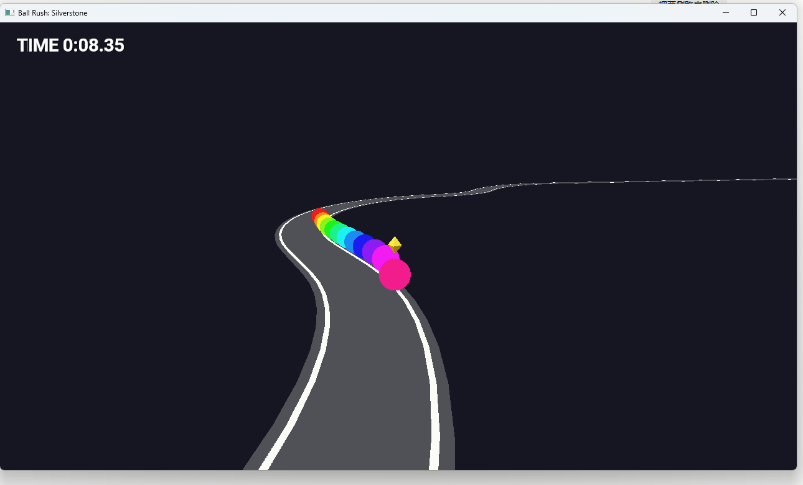

# Ball Rush: Silverstone

Author: Shangming Zhang

Design: A one-lap racing game where 12 balls race around a Silverstone-style circuit with real grip, slipstream and collision physics; start last and fight through a narrow track.

Screen Shot:

How To Play:

You are the ball with the yellow diamond over it, starting last. Finish the lap ahead of the 11 AI balls; your time is in the top-left corner.

- **W** throttle, **S** brake (reverse when stopped), **A / D** steer
- **R** restart, **Esc** quit

Brake before corners (grip is limited, so you slide if you are too fast), stay off the invisible walls at the road edge (they scrub your speed), and tuck in behind another ball to slipstream past it.

## Modelling

The track and balls are modelled in Blender by [scenes/make-silverstone.py](scenes/make-silverstone.py), which also writes the centre line (`dist/silverstone.track`) used by the physics. To rebuild the assets (Blender 4.2+):

    cd scenes
    blender --background --python make-silverstone.py -- silverstone.blend ../dist/silverstone.track
    blender --background --python export-meshes.py -- "silverstone.blend:Main" ../dist/silverstone.pnct
    blender --background --python export-scene.py -- "silverstone.blend:Main" ../dist/silverstone.scene

Balls are drawn unlit like the target in my game2; text uses FreeType + HarfBuzz with Roboto like game5 (`dist/font.ttf`, license in `dist/OFL-Roboto.txt`).

## Physics

[World.cpp](World.cpp) runs in fixed 1/120 s steps. Each ball has a velocity and a heading: throttle, brake and drag act along the heading, and the tyres cancel sideways velocity up to a grip limit (past it, the ball slides). Balls collide with impulses; the road-edge walls come from projecting each ball onto the centre line. The AI uses the same inputs as the player, following a speed profile from the track's curvature.

## Extra Credit

Are your Physics Deterministic? Yes: fixed time step, seeded RNG, fixed iteration order. Verify with the headless test (prints `determinism: OK` and `reset replay: OK`, then runs races):

    node Maekfile.js dist/sim-test.exe
    dist/sim-test.exe dist/silverstone.track

(On Windows run from a Visual Studio developer prompt. Results are bit-identical for the same compiler/CPU settings.)

Are your Physics Rewindable? No.

This game was built with [NEST](NEST.md).
